# 第01章 质点运动学

## 1.0 导航

[TOC]

## 1.1 参考系 坐标系 物理模型

> 略

------

## 1.2 位置矢量 位移 速度 加速度

### 1.2.1 位置矢量

- #### 在直角坐标系中，位矢：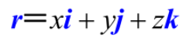

- #### 位矢 *`r`* 的大小为：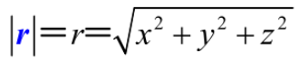

- #### 质点运动方程

  - 坐标表达式：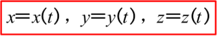
  - 位矢表达式：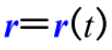

### 1.2.2 位移

- #### 位移的表达式：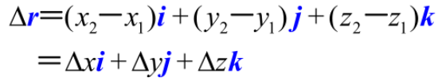

- #### 位移的模：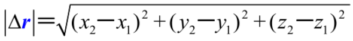

### 1.2.3 速度

- #### 平均速度：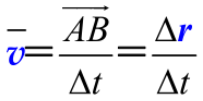

> 平均速度的方向与位移*`Δr`*的方向相同，平均速度的大小与在相应的时间*`Δt`*内每单位时间的位移大小相同。

- #### 瞬时速度：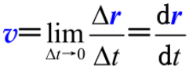

> 速度等于位矢对时间的一阶导数

- #### 平均速率：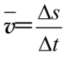

- #### 瞬时速率：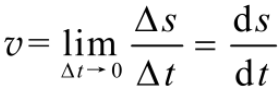

> 注意：平均速度的大小 `≠` 平均速率，瞬时速度的大小 `=` 瞬时速率

### 1.2.4 加速度

- #### 平均加速度：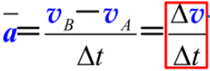

> 此处的平均加速度指*`t`*时刻附近*`Δt`*时间内的**平均加速度**

- #### 瞬时加速度：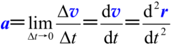

> 加速度是速度对时间的一阶导数，或位矢对时间的二阶导数

------

## 1.3 曲线运动的描述 运动学中的两类问题

### 1.3.1 曲线运动的描述

- #### 表面曲率：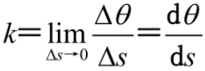

- #### 曲率半径：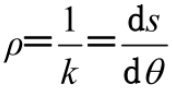

> 图示：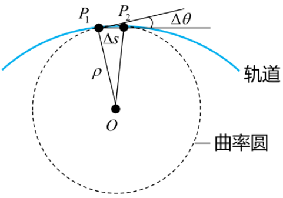

- #### 切向加速度：将加速度沿着质点所在处轨道的切线方向进行分解得到的加速度分量

- #### 法向加速度：将加速度沿着质点所在处轨道的法线方向进行分解得到的加速度分量

> 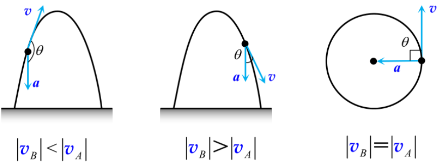

- #### 自然坐标系：坐标轴的方向可以发生变化

- #### 角速度：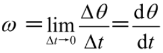

- #### 角加速度：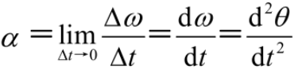

- #### 匀角加速圆周运动公式

  - 角速度：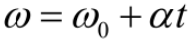
  - 角度：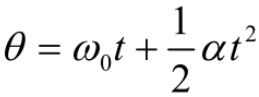
  - 无时间：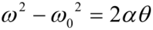

- #### 线量-角量关系：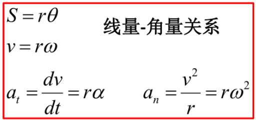

### 1.3.2 运动学中的两类问题

- #### 由已知的运动方程求速度、加速度：求导

  > 上册P15例1.4

- #### 由已知加速度和初始条件求速度和运动方程：积分

  >  上册P16例1.7

