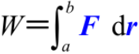
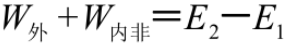
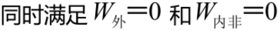

# 第02章 质点动力学

## 2.0 导航

[TOC]

------

## 2.1 牛顿运动定律

### 2.1.1 惯性定律 惯性参考系

> 略

### 2.1.2 牛顿第二定律 惯性质量 引力质量

- #### 牛顿第二定律：

- #### 万有引力定律：

> 其中，称为引力质量

### 2.1.3 牛顿第三定律

- #### 牛顿第三定律：，即作用力与反作用力

### 2.1.4 牛顿定律的应用

- #### 直角坐标系中的分量式：

- #### 自然坐标系中

  - #### 法向分量式：

  - #### 切向分量式：

> 注意：牛顿定律只适用于质点模型，只在惯性系中成立，只能在低速(不考虑相对论效应)、宏观(不考虑量子效应)的情况下适用。

------

## 2.3 动量 动量守恒定律

### 2.3.1 质点的动量定理

- #### 冲量：

- #### 质点的动量定理：作用于物体上的合外力的冲量等于物体动量的增量

  - #### 定义式：

  - #### 常用变式：

### 2.3.2 质点系的动量定理

- #### 质点系的动量定理：质点系总动量的增量等于作用于该系统上的合外力的冲量

  - #### 数学表达式：

  - #### 若合外力为0：

- #### 动量守恒定律：略

------

## 2.4 功 动能 势能 机械能守恒定律

### 2.4.1 功 功率

- #### 功

  - #### 恒力的功：

  - #### 曲线做功：

- #### 功率

  - #### 平均功率：

  - #### 瞬时功率：

- #### 保守力的功

  - #### 重力的功：

  - #### 万有引力的功：

  - #### 弹簧弹性力：

> 重力和万有引力的功都只与始末位置有关，与中间过程无关；
>
> 弹簧弹性力的功只与始末位置有关，与弹簧的中间形变过程无关

### 2.4.2 动能定理

- #### 质点的动能定理：

  - #### 定义式：

> 外力对质点所做的功=质点动能的增量

### 2.4.3 势能

- #### 势能函数：

> 势能函数的物理意义可解释为：保守力的功等于相关势能增量的负值

### 2.4.5 质点系的动能定理与功能原理

- #### 质点系的动能定理：

- #### 质点系的功能原理

  - #### 数学表达式：

  - #### 解释：系统机械能的增量等于外力的功与内部非保守力功之和

### 2.4.6 机械能守恒定律

- #### 机械能守恒的条件：

- #### 当系统的机械能守恒时：，即

> 系统势能的增量等于系统动能减少的量

### 2.4.7 能量转换与守恒定律

> 略