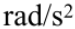

# 第03章 刚体力学基础

## 3.0 导航

[TOC]

------

## 3.1 刚体 刚体定轴转动的描述

### 3.1.1 刚体的引入

> 略

### 3.1.2 刚体的基本运动

> 

### 3.1.3 刚体定轴转动的描述

- #### 角位移：

- #### 角速度

  - #### 平均角速度：

  - #### 瞬时角速度：

  - #### 单位：`rad/s`

- #### 角加速度

  - #### 平均角加速度：

  - #### 瞬时角加速度：

  - #### 单位：

- #### 与线运动对比：

  |                            角运动                            |                            线运动                            |
  | :----------------------------------------------------------: | :----------------------------------------------------------: |
  |  |  |
  |  |  |

  

- #### 角量与线量的关系

  - #### 线速度与角速度：

  - #### 切向加速度：

  - #### 法向加速度：

> 刚体定轴转动的特征：所有质元**角量相同**，线量各不相同，并与距轴的距离*`r`*有关。

------

## 3.2 力矩 刚体定轴转动的转动定律

### 3.2.1 力矩

- #### 力对固定点的力矩

  - #### 大小：

  - #### 方向：右手定则

  - #### 力矩为零的条件

> 注意：作用力和反作用力对**同一点**的力矩之和为零

- #### 力对固定轴的力矩

  - #### 大小：

  - #### 方向：右手定则

  - #### 力矩为零的条件

### 3.2.2 刚体定轴转动的转动定律

- #### 转动惯量：

- #### 刚体定轴转动的转动定律：

> 注意：*`J`*和*`M`*均对于同一转轴而言，且此转动定律只适用于惯性系。

> 可以和类比，二者有众多相似之处。

### 3.2.3 转动惯量

- #### 公式

  - #### 单个质点：

  - #### 质点系：

  - #### 质量连续分布的刚体：

- #### 刚体的转动惯量

  > 
  >
  > 
  >
  > 

### 3.2.4 转动定律的应用

- #### 解题思路：选物体、看运动、查受力、列方程

- #### 推论：

------

## 3.3 刚体定轴转动的动能定理

### 3.3.1 转动动能

- #### 公式：

> 类比平动动能的计算公式：

### 3.3.2 力矩的功

- #### 对比平动：

|      |                             转动                             |                             平动                             |
| :--: | :----------------------------------------------------------: | :----------------------------------------------------------: |
|  功  |  |  |
| 功率 |  |  |

### 3.3.3 刚体定轴转动的动能定理

- #### 对比平动：

|                             转动                             |                             平动                             |
| :----------------------------------------------------------: | :----------------------------------------------------------: |
|  |  |

------

## 3.4 刚体定轴转动的角动量定理和角动量守恒定律

### 3.4.1 角动量 质点的角动量定理及角动量守恒定律

- #### 角动量：

  - #### 大小：

  - #### 方向：右手螺旋法则

- #### 角动量定理

  - #### 微分形式：

  - #### 积分形式：

- #### 角动量守恒定律：若，角动量常矢量

### 3.4.2 刚体对轴的角动量 刚体定轴转动的角动量定理

- #### 对轴的角动量

  - #### 大小：

  - #### 方向：右手螺旋法则

- #### 定轴转动的角动量定理：

### 3.4.3 刚体对轴的角动量守恒定律

- #### 定轴转动的角动量守恒定律：若，则有，

