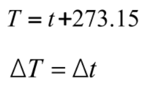
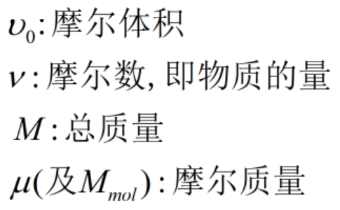
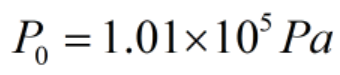
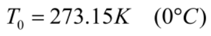
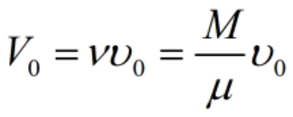
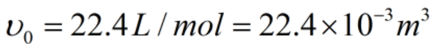
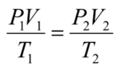
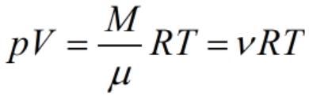
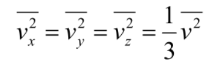
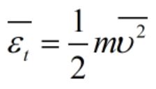

# 第07章 气体动理论基础

## 7.0 导航

## 7.1 平衡态 温度 理想气体状态方程

### 7.1.2 热力学第零定律 温度

- #### 摄氏温标与开氏温标的转换：

> 开氏温标中规定水的三相点为**273.16K**

> 0K时，任何物质内部分子静止

### 7.1.3 理想气体状态方程

- #### 符号说明：

- #### 理想气体在标准状况下：	

  - 气压：
  - 温度：
  - 体积：
  - 摩尔体积：

- #### 理想气体状态方程（一）：

- #### 理想气体状态方程（二）：

------

## 7.2 理想气体压强公式

### 7.2.1 理想气体分子模型和统计假设

> 分子可以有各种不同的速度，速度取向在各方向是等概率的

### 7.2.2 理想气体的压强公式

- #### 分子的平均平动动能：

- 

